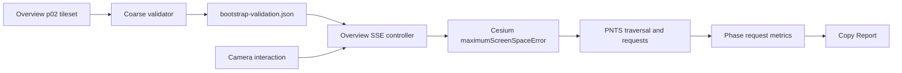

# Progressive SSE cho Overview p02

## Phần 1 — Kiến trúc (read-only)

### Goal

- Dùng một tileset `overview-p02`.
- Hiện coarse points sớm, refine khi camera ổn định.
- Giảm PNTS requests/bytes trong lúc camera di chuyển.
- Final SSE 128, khoảng 4M visible points và 60 FPS.
- Không dùng p001, không trim cache, không đổi Three.js.

### Constraints

- Flow cố định:

```text
initial: 512 → 256 → 128
moving: 256
moveEnd + 750ms: 128
```

- Bootstrap SSE 512 chỉ được bật khi coarse frontier có PNTS hợp lệ.
- Cache giữ 512MB + overflow 256MB.
- Point-size adaptive hoạt động độc lập.
- Explore/Detail không thay đổi.
- Nếu Resource Timing không cung cấp byte size, report `unsupported`.

### Design decisions

- Tạo pipeline validator duyệt từng branch từ root tới PNTS đầu tiên.
- Validator xuất `bootstrap-validation.json` gồm:
  - `coarseBootstrapReady`
  - `coarseContentTileCount`
  - `coarseContentBytes`
  - `coarseContentMaxDepth`
  - `missingBranches`
- Viewer đọc validation trước khi chọn initial SSE:
  - Pass → bắt đầu 512.
  - Missing/fail → bắt đầu trực tiếp 128.
- Tạo Overview SSE controller riêng; chỉ mutate `maximumScreenSpaceError`.
- Camera interaction chuyển controller sang `moving`; timer 750ms trở lại `ready`.
- Không recreate/destroy tileset khi đổi phase.
- Dùng PerformanceObserver phân loại PNTS request theo phase tại thời điểm request bắt đầu.

### Dependency graph



### Risks

- Coarse frontier thiếu content: bootstrap bị skip, fallback SSE 128.
- `refine: ADD` vẫn có thể gây overdraw; không xử lý trong task này.
- SSE 512 có thể quá thưa dù validator pass; cần visual validation.
- Camera/mode switching có thể để timer cũ thay đổi tileset mới; controller phải cleanup timer và kiểm tra load generation.
- Resource Timing bytes có thể bị CORS/TAO giới hạn.
- GitNexus đánh giá `loadScene` HIGH risk; logic Overview phải cô lập.

## Phần 2 — Execution

### Các bước thực hiện

1. Tạo coarse-content validator và fixture pass/fail.
2. Gọi validator sau khi build Overview p02.
3. Thêm SSE constants `512/256/128` và debounce `750ms`.
4. Thêm Overview SSE controller:
   - bootstrap validation guard
   - initial phase transitions
   - moving/moveEnd transitions
   - timeout và cleanup
5. Kết nối controller vào Overview load flow mà không đổi Explore/Detail.
6. Thêm PerformanceObserver và phase request accounting.
7. Mở rộng Copy Report và UI runtime status.
8. Chạy A/B baseline SSE 128 cố định với progressive SSE.
9. Chạy GitNexus `detect_changes()` trước commit.

### File cần sửa

- `pipeline/validate_overview_bootstrap.py` — mới, validate coarse PNTS frontier.
- `pipeline/area-overview.sh` — chạy validator sau build.
- `viewer/src/presets.ts` — SSE phase constants.
- `viewer/src/viewer.ts` — Overview SSE controller và camera lifecycle.
- `viewer/src/report.ts` — metrics theo phase và Copy Report.

### Test cần chạy

- Validator:
  - root có PNTS.
  - content nằm ở coarse descendants.
  - missing PNTS.
  - external tileset URI lỗi.
  - branch không có content.
- Viewer build: `npm run build`.
- Browser:
  - cold load pass/fail validator.
  - transition `512 → 256 → 128`.
  - moving giữ 256.
  - moveEnd 750ms về 128.
  - rapid move/start/stop không để timer race.
  - Fly Home, restore camera, đổi Overview/Explore/Detail.
  - point-size slider trong mọi Overview phase.
- A/B cùng camera path:
  - moving requests/bytes.
  - total transfer.
  - visible points.
  - interaction FPS.
  - repeated requests khi quay lại vùng cũ.

### Tiêu chí hoàn thành

- Coarse validation pass mới được dùng SSE 512.
- Validation fail fallback SSE 128, không màn hình trắng kéo dài.
- State transitions và report phase chính xác.
- Moving PNTS requests và bytes giảm ít nhất 20% so với SSE 128 cố định.
- Total transfer không tăng quá 10%.
- Final visible points 3–5M.
- Interaction FPS ≥45.
- Không reload tileset khi đổi SSE.
- Không regression Explore/Detail.
- Build pass, validator tests pass và GitNexus không phát hiện flow ngoài dự kiến.
