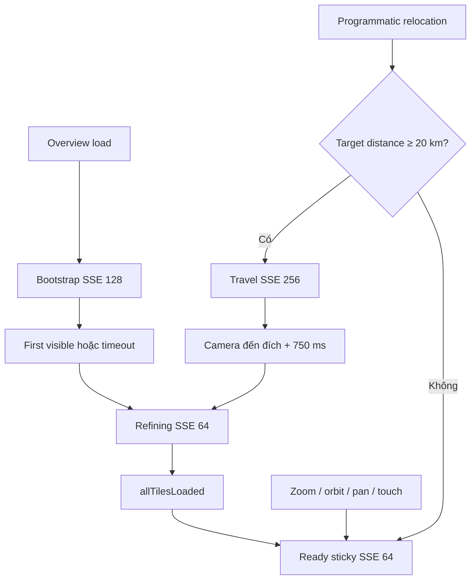

# Sticky SSE 64 cho Overview

## Phần 1 — Kiến trúc (read-only)

### Goal

- Overview đạt `SSE 64` sau bootstrap và giữ nguyên trong mọi thao tác chuột, zoom, orbit, pan và touch.
- Chỉ programmatic relocation có quãng đường `≥ 20.000 m` mới tạm dùng `SSE 256`.
- Luồng chuẩn:

```text
Bootstrap 128
  → first visible hoặc timeout
  → SSE 64 / refining
  → allTilesLoaded
  → ready, luôn SSE 64

Programmatic relocation ≥20 km
  → SSE 256 / travel
  → camera đến đích + 750 ms
  → SSE 64 / refining
  → allTilesLoaded
  → ready
```

### Constraints

- Chỉ thay runtime Overview; Explore và Detail giữ nguyên preset/SSE.
- Zoom, orbit, pan, wheel, drag và touch luôn giữ SSE hiện tại; không dùng khoảng cách con trỏ để quyết định chất lượng.
- Ngưỡng 20 km chỉ áp dụng cho `Fly Home`, restore snapshot hoặc API programmatic relocation tương lai; manual pan vẫn giữ 64.
- Đo khoảng cách bằng `Cartesian3.distance` giữa `orbitTarget` hiện tại và destination target, không dùng camera position.
- Bản đầu không tự chuyển 256 theo cache pressure; chỉ ghi telemetry để đánh giá sau.
- Không rebuild p02, không đổi point size, cache, PNTS hay tileset hierarchy.

### Design decisions

- Đổi controller từ input-driven sang travel-driven:
  - bỏ `onInteractionStart()`/`onInteractionEnd()` khỏi các mouse/touch/wheel handlers;
  - thêm `beginTravel(distanceMeters): boolean`, chỉ vào `travel/256` khi `distanceMeters >= 20_000`;
  - thêm `endTravel(started)` để sau 750 ms chuyển về `refining/64`;
  - thêm `onAllTilesLoaded()` để đổi `refining → ready` mà không đổi SSE.
- Bootstrap không đi qua SSE 256: `128 → 64` trực tiếp khi first-visible hoặc timeout 2.500 ms.
- Phase mới: `bootstrap | travel | refining | ready`.
- Giữ drag threshold 20 px chỉ để đo interaction FPS; đổi tên để không còn hàm ý liên quan SSE.
- `Fly Home` và restore snapshot tính khoảng cách trước khi thay `orbitTarget`; relocation dưới 20 km không gọi controller.
- Mọi timer/listener mang load-generation guard; relocation mới hủy timer cũ.
- Report đổi metrics `moving` thành `travel`, thêm `refining`, travel distance và transition reason.

### Dependency graph



### Risks

- GitNexus đánh giá `installPointCloudControls` là **HIGH risk**: direct caller `loadScene`, ảnh hưởng `applyMode`, `selectArea`, `useCurrentView` và bootstrap.
- SSE 64 khi tương tác có thể giữ khoảng 10M visible points, ~488 MB tileset memory và ~43 FPS theo report hiện tại.
- `allTilesLoaded` có thể phát nhiều lần; controller phải chỉ chuyển phase khi đang `refining`.
- Fly/restore liên tiếp có thể để timer cũ áp SSE lên destination mới nếu thiếu generation guard.
- Đổi tên report metrics có thể làm consumer cũ lỗi; giữ alias `moving` trong một vòng tương thích nếu report đã được dùng ngoài viewer.

## Phần 2 — Execution

### Các bước thực hiện

1. Chạy GitNexus impact cho từng symbol trước khi sửa; cảnh báo lại nếu HIGH/CRITICAL.
2. Đổi constants thành `BOOTSTRAP=128`, `TRAVEL=256`, `READY=64`, threshold `20_000 m`, settle `750 ms`.
3. Refactor `OverviewSseController` sang state machine `bootstrap/travel/refining/ready`; bỏ input-driven transitions và bảo vệ timer bằng generation.
4. Nối `allTilesLoaded` của primary Overview vào controller; cleanup listener khi unload/mode switch.
5. Gỡ controller calls khỏi mouse, wheel và touch handlers nhưng giữ interaction callbacks phục vụ FPS.
6. Bọc `Fly Home` và restore snapshot bằng kiểm tra destination-target distance; chỉ relocation ≥20 km mới dùng travel SSE.
7. Cập nhật Copy Report/UI metrics cho phase, travel distance, reason và request counts.
8. Build và chạy browser regression; cuối cùng chạy `detect_changes({scope:"compare", base_ref:"main"})`.

### File cần sửa

- `viewer/src/overview-sse-controller.ts`: state machine và travel API.
- `viewer/src/viewer.ts`: decouple input, tính travel distance, nối tileset events và cleanup.
- `viewer/src/presets.ts`: constants/threshold mới.
- `viewer/src/report.ts`: phase và telemetry mới.
- Không sửa pipeline hoặc generated tileset.

### Test cần chạy

- `cd viewer && npm run build`.
- Cold load validation pass: `128 → 64 → ready`, không xuất hiện 256.
- Validation fail/timeout: fallback trực tiếp 64, không trắng màn hình.
- Sau ready, test left-drag, right-drag, wheel, pinch, orbit và pan: SSE luôn 64.
- Programmatic relocation `<20 km`: luôn 64.
- Programmatic relocation `=20 km` và `>20 km`: `64 → 256 → 64`.
- Xác nhận `ready` chỉ xuất hiện sau `allTilesLoaded`; trong lúc tải là `refining`.
- Rapid consecutive fly/restore: không có stale timer hoặc SSE sai.
- Chuyển Overview ↔ Explore ↔ Detail, đổi area và unload: không rò timer/listener/style.
- Copy Report phản ánh đúng phase, SSE, request counts và travel distance.
- Browser performance tại SSE 64: FPS không thấp hơn 40, không crash, memory nằm trong cache + overflow.

### Tiêu chí hoàn thành

- Mọi thao tác thủ công giữ `focusEffectiveSSE = 64`, không còn tối lại chỉ vì kéo chuột.
- Chỉ programmatic relocation `≥20.000 m` kích hoạt SSE 256.
- Sau relocation, controller trở về SSE 64 và giữ sticky.
- Bootstrap không đi qua SSE 256.
- Không regression Explore/Detail, camera restore, Fly Home hoặc area selection.
- Build pass; browser matrix pass; GitNexus chỉ báo các symbol/process dự kiến.
