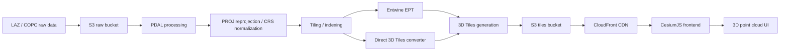

# Self-Hosted Point Cloud Pipeline

## Goal

Build an own pipeline for point cloud data so LAZ / COPC files stored on S3 can be processed into 3D Tiles and rendered in the frontend with CesiumJS.

This architecture is the self-hosted alternative to relying fully on Cesium ion for asset conversion and hosting.

Phase 1 currently runs the same architecture locally: S3 is replaced by local filesystem storage, and CloudFront is replaced by a local static HTTP server.

## Proposed Stack

| Layer | Technology | Role |
| --- | --- | --- |
| Raw Data | LAZ, COPC | Source point cloud files |
| Processing | PDAL | Point cloud processing, filtering, splitting, normalization |
| Geospatial Transform | PROJ | Coordinate reprojection and CRS handling |
| Indexing / Tiling | Entwine | Spatial indexing, usually EPT output |
| Viewer Format | 3D Tiles | CesiumJS-compatible runtime format |
| Storage | S3 | Raw data and processed tile storage |
| CDN | CloudFront | Public / controlled delivery, caching, global distribution |
| Frontend | CesiumJS | Browser-based 3D point cloud rendering |

## Phase 1 Local Prototype Stack

| Layer | Technology | Local Role |
| --- | --- | --- |
| Raw Data | LAZ | `local-storage/raw/autzen.laz` |
| Processing | PDAL + PROJ | Inspect, validate, prepare, optional COPC output |
| COPC | PDAL `writers.copc` | Prove COPC readiness, not the final viewer format |
| 3D Tiles Builder | `py3dtiles` + `laspy[lazrs]` | Convert LAZ into `tileset.json` + point cloud tile content |
| Local Storage | Filesystem | `local-storage/intermediate`, `local-storage/tilesets` |
| Local Delivery | `sirv-cli` | Serve tiles on `http://localhost:8081` |
| Frontend | Vite + TypeScript + CesiumJS | Render local 3D Tiles without Cesium ion |

## Recommended Pipeline

```text
Raw LAZ / COPC
-> S3 raw bucket
-> PDAL processing
-> PROJ reprojection / CRS normalization
-> Entwine indexing or direct 3D Tiles conversion
-> 3D Tiles output
-> S3 tiles bucket
-> CloudFront CDN
-> CesiumJS frontend
```

## Architecture Diagram



## Processing Layer

PDAL should be used for the core point cloud preparation steps:

- Validate input LAZ / COPC files.
- Normalize or clean point attributes.
- Reproject coordinates when needed.
- Split or filter data by region of interest.
- Prepare data for tiling and runtime streaming.

PROJ should handle coordinate reference system transformations so output tiles align correctly in CesiumJS.

## Indexing And 3D Tiles Generation

The main technical decision is the conversion path into Cesium-compatible 3D Tiles.

Entwine is useful for spatial indexing and can produce EPT, but EPT is not the final CesiumJS viewer format by itself. The pipeline needs a reliable conversion step from EPT, COPC, or LAZ into 3D Tiles.

Recommended abstraction:

```text
3D Tiles Builder
Input: LAZ / COPC / EPT
Output: tileset.json + point cloud tile content
Runs as: batch job / container / manual processing pipeline
```

This builder is the highest-risk part of the pipeline and should be prototyped early.

## Storage And Delivery

Use separate S3 areas or buckets for raw and processed data:

```text
s3://pointcloud-raw/
s3://pointcloud-tiles/
```

CloudFront should serve the processed 3D Tiles output to the frontend.

Important delivery concerns:

- Correct CORS headers for CesiumJS.
- Long-lived cache headers for immutable tile files.
- Shorter cache / invalidation strategy for `tileset.json`.
- Compression where applicable.
- Access control if datasets are private or pre-release.

## Frontend Integration

CesiumJS should load the resulting `tileset.json` through CloudFront.

The frontend should include:

- Quality presets: Best, Medium, Low.
- Device-specific defaults for desktop and mobile.
- A small performance probe or preloader to determine initial LOD.
- Runtime tuning for point density, screen-space error, and memory pressure.
- Clear fallback behavior for unsupported browsers or weak devices.

## Coordinate Modes And Viewer Controls

The current Phase 1 prototype uses a local/projected point cloud coordinate system from the sample LAZ. This is useful for proving the self-hosted pipeline, but it is not the same as a fully georeferenced Cesium globe workflow.

In local mode:

```text
LAZ projected/local coordinates
-> py3dtiles local transform
-> CesiumJS renders the tileset as a local 3D object
-> custom orbit / zoom / pan controls are required
```

This matters because Cesium's default camera controls are optimized for globe/geospatial scenes. When the globe is disabled and the tileset is rendered in local Cartesian space, default drag/zoom behavior can feel like looking at a flat image, zoom too aggressively, or pass through the point cloud. The viewer should therefore orbit around the tileset bounding sphere in local prototype mode.

For production geospatial mode, the pipeline should preserve or normalize CRS metadata and output a tileset transform that aligns correctly with Cesium's Earth-centered coordinate model.

```text
LAZ / COPC with known CRS
-> PDAL / PROJ CRS normalization
-> 3D Tiles with correct geospatial transform
-> CesiumJS globe/geospatial camera behavior
```

Practical implication:

- Phase 1 local prototype: use custom model-viewer controls around the point cloud bounding sphere.
- Production geospatial prototype: test CRS, reprojection, and `tileset.json` transform explicitly before relying on default Cesium globe navigation.

## Key Risks

- Choosing a stable and scalable 3D Tiles conversion path.
- Ensuring correct georeferencing and CRS alignment.
- Distinguishing local-coordinate viewer mode from production geospatial Cesium mode.
- Keeping LOD smooth enough for browser rendering.
- Handling very large datasets during batch processing.
- Avoiding excessive transfer size per user session, especially on mobile.
- Validating CesiumJS compatibility with the generated tileset.

## Why This Stack Makes Sense

- It gives the team control over hosting, conversion, and cost.
- S3 and CloudFront are well suited for large static tiled datasets.
- PDAL and PROJ are mature geospatial processing tools.
- CesiumJS can render 3D Tiles efficiently in the browser.
- The architecture remains compatible with a later decision to use Cesium ion for selected datasets if needed.

## Open Questions

- Which converter should be used for production-quality 3D Tiles generation?
- Should the pipeline use Entwine EPT as an intermediate format, or convert directly from COPC / LAZ to 3D Tiles?
- What target CRS should be standardized for CesiumJS?
- Should the product use a local model-viewer mode, a geospatial globe mode, or both depending on dataset/use case?
- What is the acceptable max data transfer per user session on mobile and desktop?
- Should processing run manually, in CI, or as containerized batch jobs?
- How will private datasets be protected when served through CloudFront?
