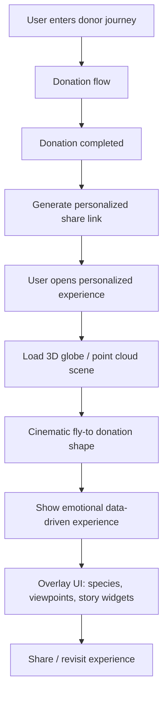
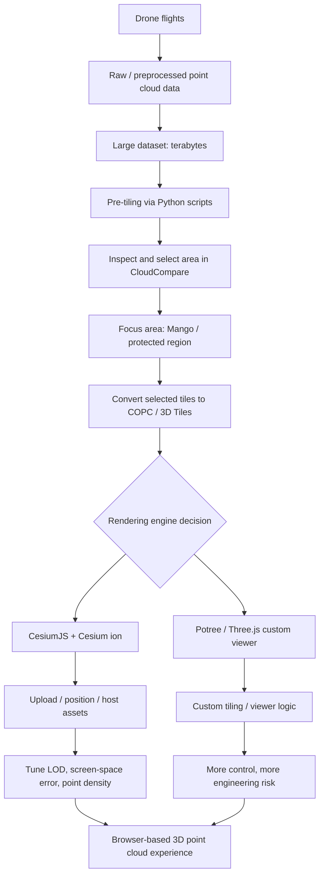
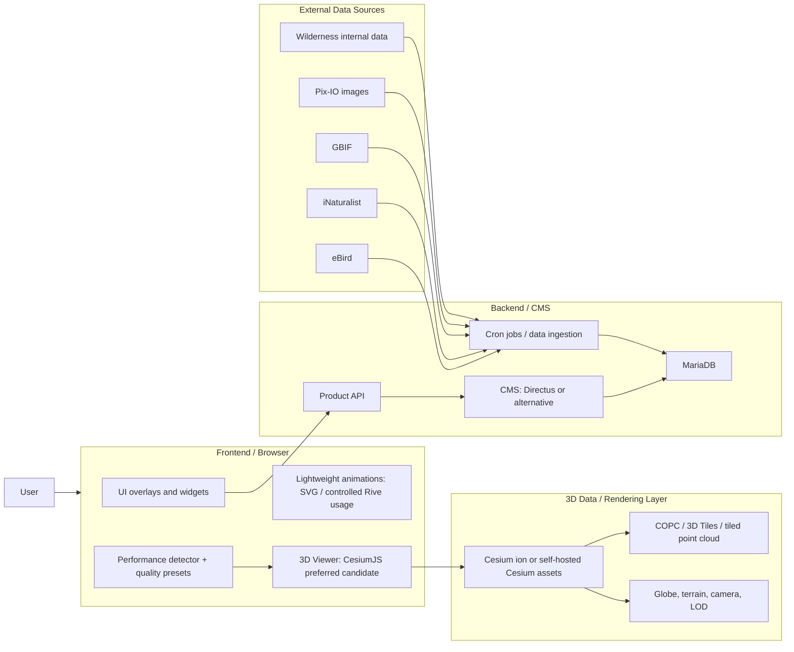
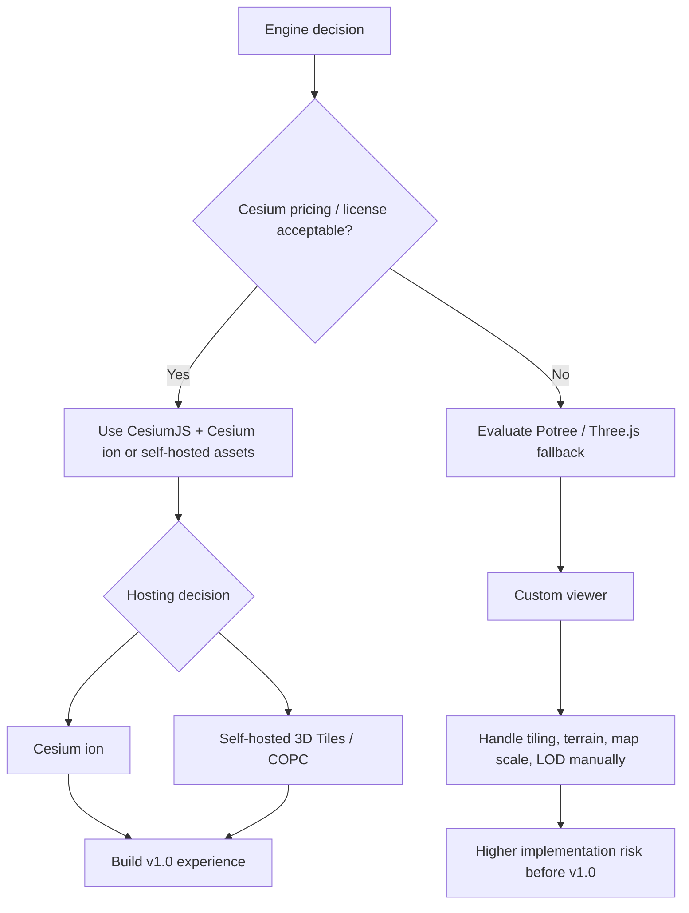

# WI x SBB Workflow + Architecture

## Product Workflow



## Point Cloud Workflow



## Target Architecture



## Decision Architecture



## Short Architecture Summary

```text
Donation journey
-> personalized link
-> browser loads Cesium-based 3D scene
-> point cloud / 3D tiles streamed with LOD
-> UI overlays add story, species, viewpoints
-> backend serves structured content from CMS / MariaDB
-> external biodiversity data is synced locally via cron jobs
```

## Key Notes

- The current critical path is choosing and proving the 3D engine, not UI animation.
- The architecture is currently leaning toward Cesium, tiled point cloud assets, and a separate CMS/backend.
- Potree/Three.js remains a fallback or comparison path, but it carries higher custom-engineering risk.
- WebGL2 is considered sufficient for v1.0; WebGPU is not ready for production use in this context.
- Quality presets should be planned early: Best, Medium, Low, with sensible defaults for desktop and mobile.
- A small preloader or performance probe can help select the initial LOD and quality settings.
- External data sources such as GBIF, iNaturalist, and eBird should be synced into local storage instead of queried live during the user experience.
